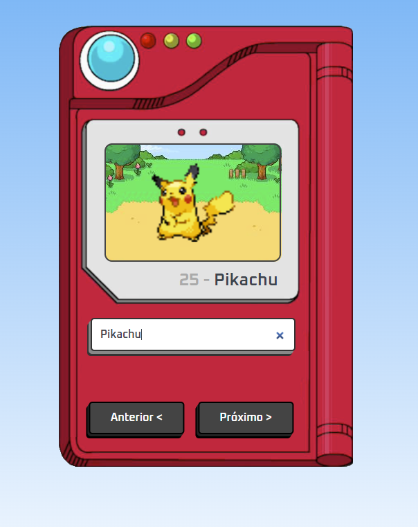

# Projeto Pokédex
>Pokedex que realiza a busca dos pokemons atraves de nome ou numero em uma API e fornece os dados de imagem, nome e numero. 

#### Linguagens Utilizadas: 
- HTML
- CSS
- JavaScript
---

### Imagem Inicial Pokédex


---
### Imagem Final Pokédex


---
#### Neste area do código foram adicionadas as imagens dos pokemons, nome e numero através de uma API e  tambem tratamento de erro caso o numero e nome digitado estivessem errados
- **Linguagem: JavaScrpit**
```js
const pokemonName = document.querySelector('.pokemon__name');
const pokemonNumber = document.querySelector('.pokemon__number');
const pokemonImage = document.querySelector('.pokemon__image');

const form = document.querySelector('.form');

const input = document.querySelector('.input__search');
const buttonPrev = document.querySelector('.btn-prev');
const buttonNext = document.querySelector('.btn-next');

let searchPokemon = 1;

const fetchPokemon = async (pokemon) => {
    const APIResponse = await fetch(`https://pokeapi.co/api/v2/pokemon/${pokemon}`);

    if (APIResponse.status === 200){
        const data = await APIResponse.json();
        return data;
    }
}

const renderPokemon = async (pokemon) => {
    pokemonName.innerHTML = 'carregando...';
    pokemonNumber.innerHTML = '';
    const data = await fetchPokemon(pokemon);

    if (data){
        pokemonImage.style.display = 'block';
        pokemonName.innerHTML = data.name;
        pokemonNumber.innerHTML = data.id;
        pokemonImage.src = data ['sprites']['versions']['generation-v']['black-white']['animated']['front_default'];
        input.value='';
        searchPokemon = data.id;
    }else {
        pokemonImage.style.display = 'none';
        pokemonName.innerHTML = 'Não encontrado :('
        pokemonNumber.innerHTML = '';
    }
}

form.addEventListener('submit', (event) => {
    event.preventDefault();
    renderPokemon(input.value.toLowerCase());
});

buttonPrev.addEventListener('click', () => {
    if (searchPokemon > 1){
        searchPokemon -= 1;
        renderPokemon(searchPokemon);
    }
    
});

buttonNext.addEventListener('click', () => {
    searchPokemon += 1;
    renderPokemon(searchPokemon);
});
renderPokemon(searchPokemon);
```
#### Area do código referente a parte em HTML
- Linguagem: HTML
```HTML
<!DOCTYPE html>
<html lang="en">
<head>
    <meta charset="UTF-8">
    <meta name="viewport" content="width=device-width, initial-scale=1.0">

    <!-- Links -->
    <link rel="icon" href="./favicon/favicon-16x16.png">
    <link rel="stylesheet" href="./css/style.css">

    <!-- Java Script -->
    <script defer src="./js/script.js"></script>

    <title>gustavopokedex</title>
</head>
<body>

    <main>
        

        <h1 class="pokemon__data">
            <span class="pokemon__number"></span> -
            <span class="pokemon__name"></span>
        </h1>

        <form class="form">
            <input type="search"
            class="input__search"
            placeholder="Nome ou Número"
            required
            
            />
        </form>

        <div class="buttons">
            <button class="button btn-prev">Anterior &lt;</button>
            <button class="button btn-next">Próximo &gt;</button>
        </div>

        
    </main>
    
</body>
</html>
```
#### E por Fim atraves do CSS adicionando escalabilidade na imagem da pokédex e estilização da caixa de pesquisa e botões
- Linguagem: CSS
```CSS
@import url('https://fonts.googleapis.com/css2?family=Oxanium:wght@300;400;500;600;700;800&display=swap');
* {
    margin: 0;
    padding: 0;
    box-sizing: border-box;
    font-family: 'Oxanium', cursive;
}
body {
    text-align: center;
    background: linear-gradient(to bottom, #6ab7f5, #fff);
    min-height: 100vh;
}
main {
    display: inline-block;
    margin-top: 2%;
    padding: 15px;
    position: relative;
}
.pokedex {
    width: 100%;
    max-width: 425px;
}
.pokemon__image{
    position: absolute;
    bottom: 55%;
    left: 50%;
    transform: translate(-63%, 20%);
    height: 18%;
}
.pokemon__data{
    position: absolute;
    font-weight: 600;
    color: #aaa;
    top: 54.5%;
    right: 27%;
    font-size: clamp(8px, 5vw, 25px);
}
.pokemon__name{
    color: #3a444d;
    text-transform: capitalize;
}
.form{
    position: absolute;
    width: 65%;
    top: 65%;
    left: 13.5%;
}
.input__search{
    width: 100%;
    padding: 4%;
    outline: none;
    border: 2px solid #333;
    border-radius: 5px;
    font-weight: 600;
    color: #3a444d;
    font-size: clamp(8px, 5vw, 1rem);
    box-shadow: -3px 4px 0 #888, -5px 7px 0 #333;
}
.buttons{
    position:absolute;
    bottom: 10%;
    left: 50%;
    width: 65%;
    transform: translate(-57%, 0);
    display: flex;
    gap: 20px;
}
.button {
    width: 50%;
    padding: 4%;
    border: 2px solid #000;
    border-radius: 5px;
    font-size: clamp(8px, 5vw, 1rem);
    font-weight: 600;
    color: white;
    background-color: #444;
    box-shadow: -2px 3px 0 #222, -4px 6px 0 #000;
}
.button:active{
    box-shadow: inset -4px 4px 0 #222;
    font-size: 0.9rem;
}
```
---
## Contato 

Gustavo Moreno - [Linkedin](https://www.linkedin.com/in/gustavo-moreno-5803a0229)

Meu e-mail: gustavomorenosiqueira86@gmail.com

Celular: (11) 99786-8798


